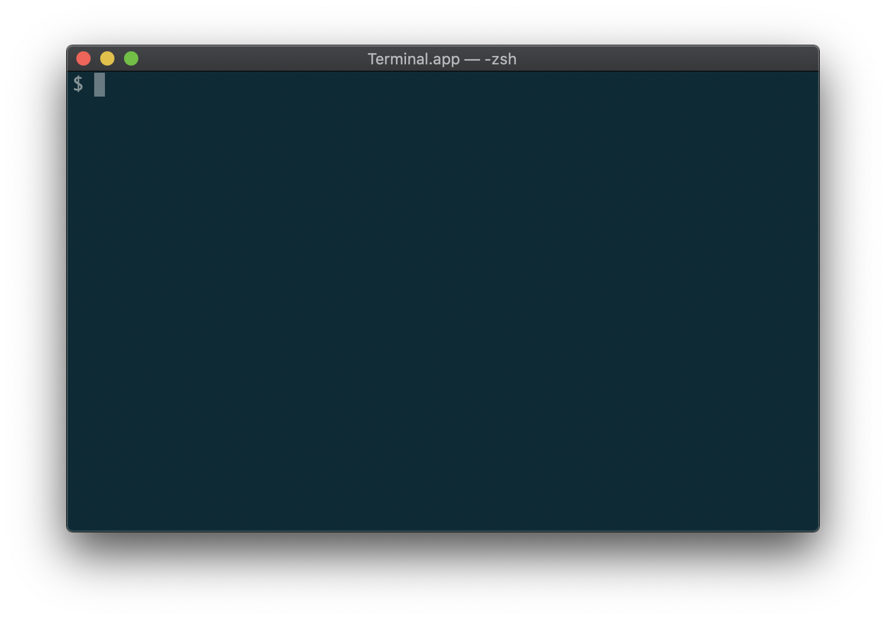
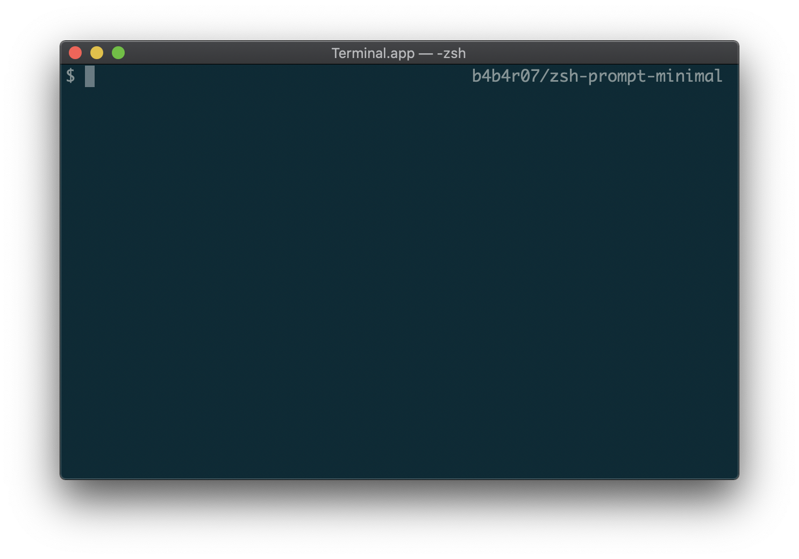
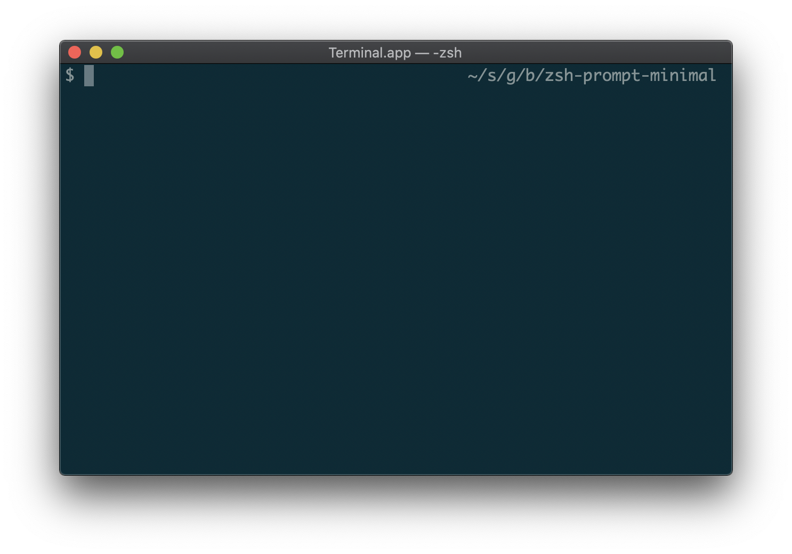
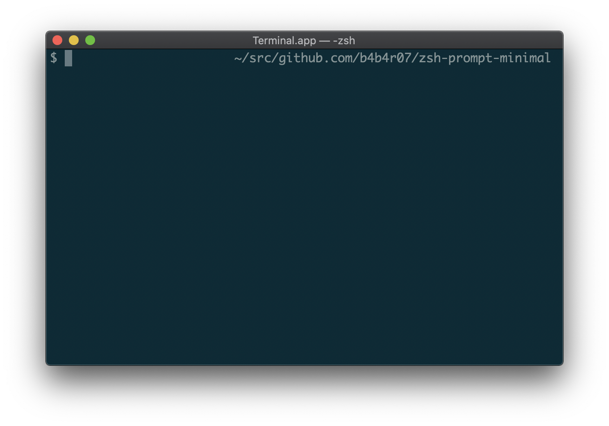

# minimal.zsh-theme

Less is more, so super fast, minimal and no dissatisfaction!

The idea comes from https://github.com/b4b4r07/ultimate but this provides more simple.

## Features

- Super fast, super minimal
- Supports left prompt (PROMPT), right prompt (RPROMPT)
- Supports various path styles
  - It can be changed by `PROMPT_PATH_STYLE`. It accepts:
    - `default` (means no right prompt used)
    - `minimal`
    - `shortpath`
    - `fullpath`
- Provides two tiny functions:
  - `prompt-enable`: To be used for enabling right prompt
  - `prompt-disable`: For disabling

| Style | Image |
|---|---|
| minimal |  |
| shortpath |  |
| fullpath |  |

## License

MIT

