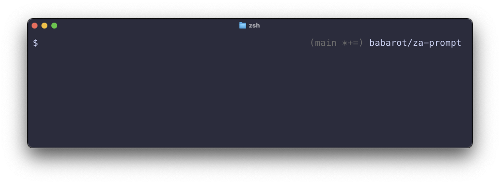

# za-prompt

⚡ A fast, minimal, and highly customizable zsh prompt theme.

<div align="center">

<p>Super fast, super minimal, and no dissatisfaction!</p>
</div>

## Features

- **Super fast and minimal** - Lightweight with minimal overhead
- **Fully customizable layout** - Template-based system with placeholders
- **Git integration** - Built-in support for git-prompt.sh with detailed status
- **Flexible configuration** - Uses zsh's native `zstyle` for organized settings
- **Multiple path styles** - Choose from minimal, shortpath, or fullpath
- **Vi mode support** - Optional visual indicator for vim modes
- **Color customization** - Full control over colors using zsh prompt sequences

## Installation

### Manual Installation

Clone this repository and source the theme file:

```zsh
git clone https://github.com/babarot/za-prompt.git
echo "source /path/to/za-prompt/za-prompt.zsh-theme" >> ~/.zshrc
```

### With [afx](https://github.com/babarot/afx/)

```yaml
- name: babarot/za-prompt
  description: Super fast zsh prompt (Za = Zsh Alternative / Zap)
  owner: babarot
  repo: za-prompt
  plugin:
    sources:
    - '*.zsh-theme'
    snippet-prepare: |
      zstyle ':prompt:za:path' style 'minimal'
      zstyle ':prompt:za:right' template '%exitcode% %F{242}(%git%)%f %path%'
      zstyle ':prompt:za:left' template '%sign% '
```

## Configuration

This theme uses `zstyle` for configuration, providing a hierarchical and organized way to customize your prompt.

### Quick Start

The default configuration provides a clean prompt with minimal information:

```zsh
# Default: Left prompt shows $, right prompt shows exit code, path, and git info
source za-prompt.zsh-theme
```

### Template System

Customize your prompt layout using templates with placeholders:

```zsh
zstyle ':prompt:za:left' template '%sign% '
zstyle ':prompt:za:right' template '%exitcode% %path% %git%'
```

#### Available Placeholders

- `%sign%` - Prompt sign (customizable, default: `$`)
- `%path%` - Current working directory
- `%git%` - Git branch and status information
- `%exitcode%` - Exit code of last command (only shown on error)

### Path Styles

Configure how the path is displayed:

```zsh
zstyle ':prompt:za:path' style 'minimal'
```

Available styles:
- `minimal` - Show only last 2 directories (default)
- `shortpath` - Abbreviated path with shortened directory names
- `fullpath` - Full absolute path with `~` for home directory

### Prompt Sign

Change the prompt character:

```zsh
zstyle ':prompt:za:sign' char '>'
```

### Git Integration

The theme includes git-prompt.sh for displaying git repository information.

#### Basic Git Configuration

```zsh
# Change git format (brackets, parentheses, etc.)
zstyle ':prompt:za:git' format ' [%s]'
# or
zstyle ':prompt:za:git' format ' (%s)'

# Enable detailed git status
zstyle ':prompt:za:git' show-dirty true
zstyle ':prompt:za:git' show-untracked true
zstyle ':prompt:za:git' show-stash true
zstyle ':prompt:za:git' show-upstream true
```

Git status indicators (when enabled):
- `*` - Unstaged changes
- `+` - Staged changes
- `%` - Untracked files
- `$` - Stashed changes
- `<>` - Diverged from upstream
- `<` - Behind upstream
- `>` - Ahead of upstream

### Vi Mode Support

Enable vi mode indicator:

```zsh
zstyle ':prompt:za:vimode' enable true
```

The prompt sign will change color based on the current vim mode:
- Insert mode: Default color
- Normal mode: White
- Visual mode: Yellow
- Replace mode: Red

## Customization Examples

### Example 1: Classic Style `[$ minimal (git)]`

```zsh
zstyle ':prompt:za:left' template '[%sign% %path% %git%] '
zstyle ':prompt:za:right' template '%exitcode%'
```

### Example 2: Git First `[(git) $ shortpath]`

```zsh
zstyle ':prompt:za:left' template '%git% %sign% '
zstyle ':prompt:za:right' template '%exitcode% %path%'
zstyle ':prompt:za:path' style 'shortpath'
```

### Example 3: Everything on Left

```zsh
zstyle ':prompt:za:left' template '%sign% %path% %git% '
zstyle ':prompt:za:right' template ''
```

### Example 4: No Git Information

```zsh
zstyle ':prompt:za:left' template '%sign% '
zstyle ':prompt:za:right' template '%exitcode% %path%'
```

### Example 5: Custom Colors

Use zsh color sequences directly in templates:

```zsh
# Dark gray git info
zstyle ':prompt:za:right' template '%exitcode% %path% %F{242}%git%%f'

# Blue path, gray git
zstyle ':prompt:za:right' template '%exitcode% %F{blue}%path%%f %F{8}%git%%f'

# Custom sign with color
zstyle ':prompt:za:left' template '%F{green}%sign%%f '
```

Color specification:
- `%F{color}` - Set foreground color
- `%f` - Reset foreground color
- `%K{color}` - Set background color
- `%k` - Reset background color

Color values can be:
- Color names: `red`, `green`, `blue`, `yellow`, `cyan`, `magenta`, `white`, `black`
- ANSI colors: `0-15`
- 256 colors: `0-255` (e.g., `242` for dark gray)

### Example 6: Full Git Status with Colors

```zsh
zstyle ':prompt:za:left' template '%sign% '
zstyle ':prompt:za:right' template '%exitcode% %F{blue}%path%%f %F{242}%git%%f'
zstyle ':prompt:za:git' format ' (%s)'
zstyle ':prompt:za:git' show-dirty true
zstyle ':prompt:za:git' show-untracked true
zstyle ':prompt:za:git' show-upstream true
```

## Configuration Reference

### All Available zstyle Settings

| Context | Key | Type | Default | Description |
|---------|-----|------|---------|-------------|
| `:prompt:za:left` | `template` | string | `%sign% ` | Left prompt template |
| `:prompt:za:right` | `template` | string | `%exitcode% %path% %git%` | Right prompt template |
| `:prompt:za:path` | `style` | string | `minimal` | Path display style |
| `:prompt:za:sign` | `char` | string | `$` | Prompt sign character |
| `:prompt:za:git` | `format` | string | ` (%s)` | Git info format string |
| `:prompt:za:git` | `show-dirty` | boolean | `false` | Show dirty state |
| `:prompt:za:git` | `show-untracked` | boolean | `false` | Show untracked files |
| `:prompt:za:git` | `show-stash` | boolean | `false` | Show stash state |
| `:prompt:za:git` | `show-upstream` | boolean | `false` | Show upstream state |
| `:prompt:za:vimode` | `enable` | boolean | `false` | Enable vi mode indicator |

## Backward Compatibility

The theme maintains backward compatibility with environment variables:

```zsh
# Old style (still supported)
PROMPT_PATH_STYLE="shortpath"
PROMPT_SIGN=">"
PROMPT_USE_VIM_MODE=true

# New style (recommended)
zstyle ':prompt:za:path' style 'shortpath'
zstyle ':prompt:za:sign' char '>'
zstyle ':prompt:za:vimode' enable true
```

## License

MIT

## Credits

The idea comes from [ultimate](https://github.com/b4b4r07/ultimate) but provides a more simple and customizable approach.
